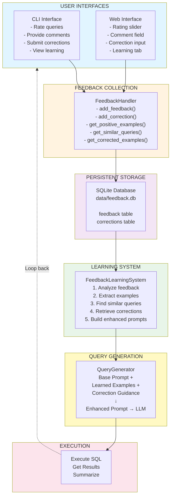
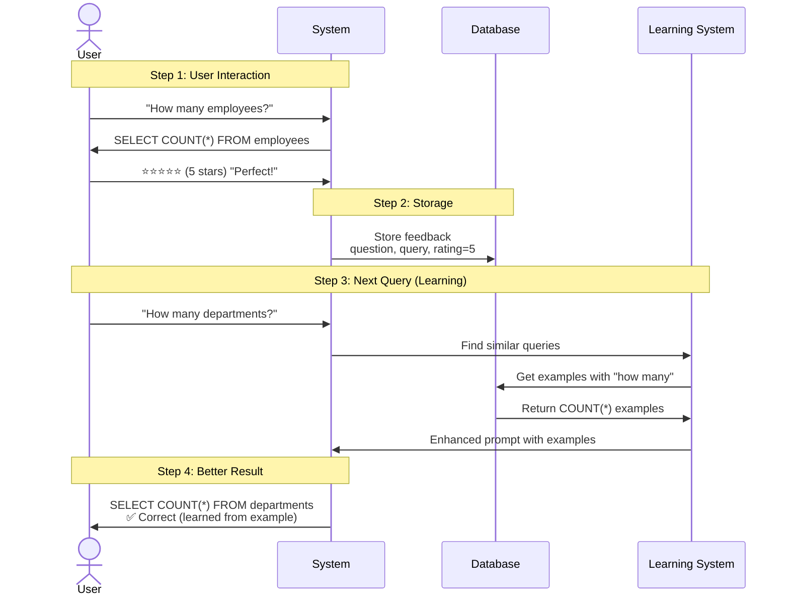
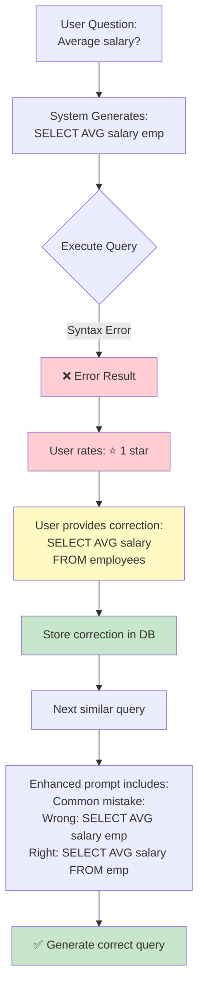
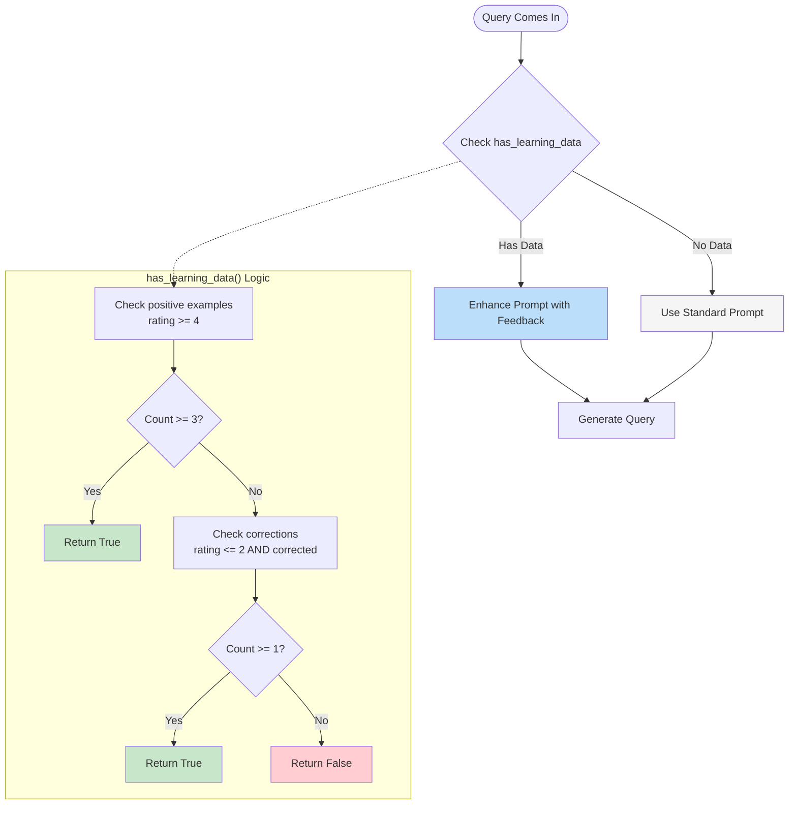
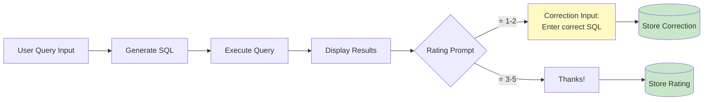

# Visual Guide: Closed Feedback Loop System

## System Architecture

### Mermaid Diagram



### Text Diagram

```
┌─────────────────────────────────────────────────────────────┐
│                      USER INTERFACES                        │
│  ┌───────────────────────┐         ┌─────────────────────┐  │
│  │   CLI Interface       │         │   Web Interface     │  │
│  │  - Rate queries       │         │  - Rating slider    │  │
│  │  - Provide comments   │         │  - Comment field    │  │
│  │  - Submit corrections │         │  - Correction input │  │
│  │  - View learning      │         │  - Learning tab     │  │
│  └──────────┬────────────┘         └──────────┬──────────┘  │
└─────────────┼────────────────────────────────┼──────────────┘
              │                                │
              └────────────────┬───────────────┘
                               ↓
┌────────────────────────────────────────────────────────────────┐
│                   FEEDBACK COLLECTION                          │
│  ┌──────────────────────────────────────────────────────────┐  │
│  │           FeedbackHandler                                │  │
│  │  - add_feedback(question, query, rating, comment)        │  │
│  │  - add_correction(feedback_id, original, corrected)      │  │
│  │  - get_positive_examples()                               │  │
│  │  - get_similar_queries(question)                         │  │
│  │  - get_corrected_examples()                              │  │
│  └──────────────────────────────────────────────────────────┘  │
└──────────────────────────────┬─────────────────────────────────┘
                               ↓
┌────────────────────────────────────────────────────────────────┐
│                    PERSISTENT STORAGE                          │
│  ┌──────────────────────────────────────────────────────────┐  │
│  │           SQLite Database (data/feedback.db)             │  │
│  │                                                          │  │
│  │  feedback table:                                         │  │
│  │    - question, sql_query, rating, comment, timestamp     │  │
│  │                                                          │  │
│  │  corrections table:                                      │  │
│  │    - feedback_id, original_query, corrected_query        │  │
│  └──────────────────────────────────────────────────────────┘  │
└──────────────────────────────┬─────────────────────────────────┘
                               ↓
┌─────────────────────────────────────────────────────────────────┐
│                   LEARNING SYSTEM                               │
│  ┌──────────────────────────────────────────────────────────┐   │
│  │        FeedbackLearningSystem                            │   │
│  │                                                          │   │
│  │  1. Analyze stored feedback                              │   │
│  │  2. Extract positive examples (rating ≥ 4)               │   │
│  │  3. Find similar queries (keyword matching)              │   │
│  │  4. Retrieve user corrections                            │   │
│  │  5. Build enhanced prompts                               │   │
│  │                                                          │   │
│  │  Methods:                                                │   │
│  │  - build_learned_examples(question)                      │   │
│  │  - build_correction_guidance()                           │   │
│  │  - enhance_prompt_with_feedback(prompt, question)        │   │
│  └──────────────────────────────────────────────────────────┘   │
└──────────────────────────────┬──────────────────────────────────┘
                               ↓
┌─────────────────────────────────────────────────────────────────┐
│                   QUERY GENERATION                              │
│  ┌──────────────────────────────────────────────────────────┐   │
│  │           QueryGenerator                                 │   │
│  │                                                          │   │
│  │  Base Prompt                                             │   │
│  │       +                                                  │   │
│  │  Learned Examples (if available)                         │   │
│  │       +                                                  │   │
│  │  Correction Guidance (if available)                      │   │
│  │       ↓                                                  │   │
│  │  Enhanced Prompt → LLM → Better SQL Query                │   │
│  └──────────────────────────────────────────────────────────┘   │
└──────────────────────────────┬──────────────────────────────────┘
                               ↓
┌─────────────────────────────────────────────────────────────────┐
│                      EXECUTION                                  │
│  ┌──────────────────────────────────────────────────────────┐   │
│  │  Execute SQL → Get Results → Summarize                   │   │
│  └──────────────────────────────────────────────────────────┘   │
└──────────────────────────────┬──────────────────────────────────┘
                               ↓
                    Present to User (loop back)
```

## Data Flow: User Feedback to Improved Queries

### Mermaid Diagram



### Text Diagram

```
Step 1: User Interaction
┌───────────────────────────────────────────┐
│ User: "How many employees are there?"     │
│ System: "SELECT COUNT(*) FROM employees"  │
│ User: ⭐⭐⭐⭐⭐ (5 stars) "Perfect!"   │
└───────────────────────────────────────────┘
                    ↓
Step 2: Storage
┌─────────────────────────────────────────┐
│ Saved to database:                      │
│ - question: "How many employees..."     │
│ - query: "SELECT COUNT(*)..."           │
│ - rating: 5                             │
│ - comment: "Perfect!"                   │
└─────────────────────────────────────────┘
                    ↓
Step 3: Learning (Next Query)
┌─────────────────────────────────────────┐
│ User asks: "How many departments?"      │
│                                         │
│ System finds similar query:             │
│ ✓ Keywords: "how many" (similar)        │
│ ✓ Previous: COUNT(*) worked well        │
│                                         │
│ Enhanced prompt includes:               │
│ "Example: Q: How many employees?        │
│          A: SELECT COUNT(*) FROM..."    │
└─────────────────────────────────────────┘
                    ↓
Step 4: Better Result
┌─────────────────────────────────────────┐
│ Generated: "SELECT COUNT(*) FROM        │
│             departments"                │
│                                         │
│ ✅ Correct syntax (learned from example)│
│ ✅ Higher success rate                  │
└─────────────────────────────────────────┘
```

## Correction Flow

### Mermaid Diagram



### Text Diagram

```
User provides wrong query correction:

Before:
┌─────────────────────────────────────────┐
│ Question: "Average salary?"             │
│ Generated: "SELECT AVG(salary) emp"     │
│ Result: ❌ Syntax Error                 │
│ Rating: ⭐ (1 star)                     │
└─────────────────────────────────────────┘
                    ↓
User corrects:
┌─────────────────────────────────────────┐
│ Corrected: "SELECT AVG(salary)          │
│             FROM employees"             │
│                                         │
│ System stores correction                │
└─────────────────────────────────────────┘
                    ↓
Next similar query:
┌────────────────────────────────────────┐
│ Prompt includes:                       │
│ "Common mistake to avoid:              │
│  Wrong: SELECT AVG(salary) emp         │
│  Right: SELECT AVG(salary) FROM emp"   │
│                                        │
│ Result: ✅ Correct query generated    │
└────────────────────────────────────────┘
```

## Learning Activation Logic

### Mermaid Diagram



### Text Diagram

```
┌─────────────────────────────────────────┐
│ Check: has_learning_data()              │
└─────────────────────────────────────────┘
                    ↓
         ┌──────────┴──────────┐
         ↓                     ↓
┌──────────────────┐  ┌──────────────────┐
│ Positive examples│  │   Corrections    │
│   (rating ≥ 4)   │  │  (any number)    │
└──────────────────┘  └──────────────────┘
         ↓                     ↓
    Count ≥ 3?            Count ≥ 1?
         ↓                     ↓
         └──────────┬──────────┘
                    ↓
              YES or YES?
                    ↓
              ┌─────────┐
              │ ENABLE  │
              │LEARNING │
              └─────────┘
                    ↓
        Use feedback in prompts
```

## UI Components

### Mermaid Diagram - CLI Flow



### Mermaid Diagram - Web Interface Layout

```mermaid
graph TB
    subgraph "Query Tab"
        W1[Question Input]
        W2[Generate Button]
        W3[Results Display]
        W4[Rating 1-5 ⭐]
        W5[Correction Input<br/>If rating ≤ 2]
        W6[Submit Feedback Button]
        
        W1 --> W2 --> W3
        W3 --> W4 --> W5 --> W6
    end
    
    subgraph "Learning System Tab"
        L1[Status Display:<br/>✅ Active / ⚠️ Inactive]
        L2[Positive Examples: X]
        L3[Corrections: Y]
        L4[Recent Improvements List]
        L5[Refresh Button]
        
        L1 --- L2 --- L3 --- L4 --- L5
    end
    
    style W5 fill:#fff9c4
    style L1 fill:#bbdefb
    style L4 fill:#c8e6c9
```



### Text Mockups

### CLI Commands:
```
┌─────────────────────────────────────────────────┐
│ TEXT-TO-SQL APPLICATION                         │
├─────────────────────────────────────────────────┤
│ Commands:                                       │
│ • Type question      → Generate SQL             │
│ • compare           → Compare LLMs              │
│ • stats             → Feedback statistics       │
│ • learning          → Learning system status    │
│ • quit/exit         → Exit                      │
├─────────────────────────────────────────────────┤
│ 💭 Your question: _                             │
└─────────────────────────────────────────────────┘
```

### Web Interface Tabs:
```
┌───────────────────────────────────────────────────────┐
│ [Query Generator] [Model Comparison] [Statistics]     │
│ [Learning System] [About]                             │
├───────────────────────────────────────────────────────┤
│                                                       │
│  Your Question: [________________]                    │
│                                                       │
│  ☐ Use Few-Shot   ☐ Use Chain-of-Thought             │
│                                                       │
│  [Generate SQL]                                       │
│                                                       │
│  Generated SQL: SELECT COUNT(*) FROM employees        │
│                                                       │
│  Results: [table with data]                           │
│                                                       │
│  Rating: [1----3----5]                                │
│  Comment: [____]                                      │
│  Correction (optional): [____]                        │
│                                                       │
│  [Submit Feedback]                                    │
└───────────────────────────────────────────────────────┘
```

## Metrics Dashboard

```
┌─────────────────────────────────────────────────┐
│           LEARNING SYSTEM STATUS                │
├─────────────────────────────────────────────────┤
│ Learning Data Available:  ✅ Yes                │
│ Positive Examples:        12                    │
│ Corrections:              3                     │
│ Total Feedback:           18                    │
│ Average Rating:           4.2/5 ⭐⭐⭐⭐      │
├─────────────────────────────────────────────────┤
│ IMPROVEMENT SUGGESTIONS:                        │
│ • Feedback system working well!                 │
│ • Continue providing feedback                   │
└─────────────────────────────────────────────────┘
```

## Key Success Indicators

### System is Learning When:
✅ Positive examples > 0
✅ Similar queries return faster/better results
✅ Average rating increases over time
✅ Fewer syntax errors
✅ Corrections reduce repeated mistakes

### System Needs More Data When:
⚠️ Positive examples < 3
⚠️ No corrections recorded
⚠️ Average rating < 3.5
⚠️ Total feedback < 10
